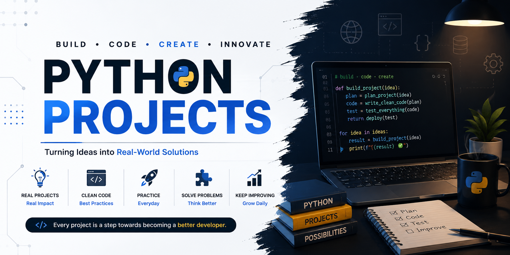

<p align="center">
  
</p>

# 🐍 Python Projects

A collection of Python projects that I build while learning, practising,
and improving my programming skills.

This repository focuses on turning Python concepts into practical,
real-world projects.

---

## 🎯 Purpose

The goal of this repository is to:

- 🧠 Strengthen Python fundamentals
- 💻 Build practical projects
- 🛠️ Improve problem-solving skills
- 🧩 Learn how different Python concepts work together
- 🚀 Gain experience building real-world applications
- 📈 Track my progress as I become a better developer

---

## 🛠️ Tech Stack

<p align="center">
  
</p>

---

## 📂 Projects

| #   | Project          | Description                                     | Status       |
| --- | ---------------- | ----------------------------------------------- | ------------ |
| 01  | Guess No.        | Guess A number between (0 to 10)                | ✅ Completed |
| 02  | Quiz Game        | Answer the question and get points              | ✅ Completed |
| 03  | RockPaperScissor | No need to explain                              | ✅ Completed |
| 04  | Adventure Game   | Raigbait game will never win cause i made it ☠️ | ✅ Completed |

> More projects will be added as I continue learning and building.

---

## 📚 Concepts I'm Applying

Through these projects, I am practising concepts such as:

- Variables & Data Types
- Conditional Statements
- Loops
- Functions
- Lists, Tuples, Sets & Dictionaries
- Object-Oriented Programming
- File Handling
- Exception Handling
- Modules & Packages
- APIs
- Automation
- Problem Solving

---

## 📈 Project Journey

```text
Learn Python
     ↓
Understand Concepts
     ↓
Practice
     ↓
Build Small Projects
     ↓
Solve Real Problems
     ↓
Build Better Projects
     ↓
Become a Better Developer# PythonProjects
```

# PythonProjects
